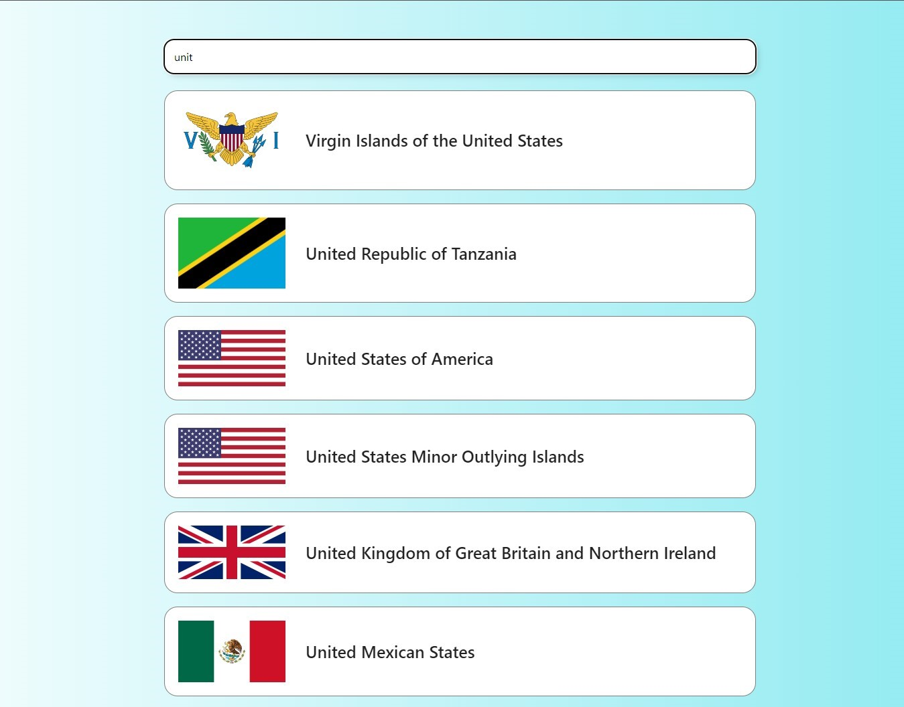
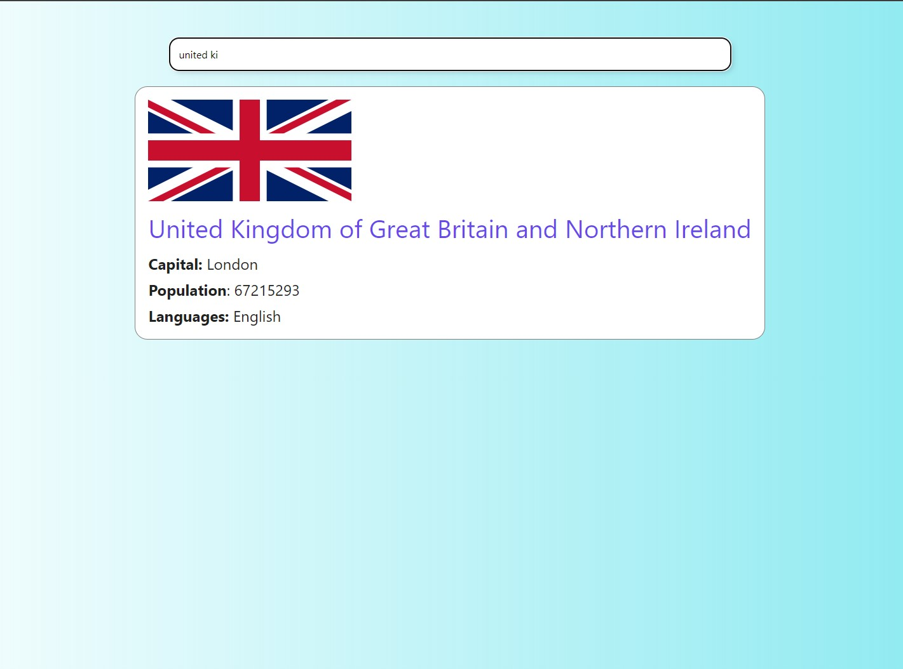

# This web application allows you to search for countries and get brief information about them.

## The project is based on Parcel.

#### 1. A front-end part of the application for searching data about a country by its partial or full name has been created.

#### 2. The public API Rest Countries is used.

#### 3. The user enters the name of the country to search for in the text field.

#### 4. HTTP requests are made when the country name is typed.

#### 5. In order not to make a request every time a key is pressed, the Debounce trick is used. Which makes an HTTP request 300ms after the user has stopped typing.

#### 6. If the user completely clears the search field, then the HTTP request fails and the country list or country information markup is lost.

#### 7. The input string has been sanitized using the trim() method.

#### 8. If the backend returned more than 10 countries in the response, a notification appears in the interface that the name should be more specific.

#### 9. "Too many matches found. Please enter a more specific name.".

#### 10. If the backend returned from 2 to 10 countries, a list of found countries is displayed under the test field. Each element of the list consists of a flag and a country name.

#### 11. If the result of the query is an array with one country, the interface displays the layout of the card with country data: flag, name, capital, population, and languages.

#### 12. If the user enters a country name that does not exist, the user will receive a notification "Oops, there is no country with that name".

#### 13. Adaptive design to mobile, table, desktop.

#### 14. Using Pure JavaScript, SCSS, HTML.

